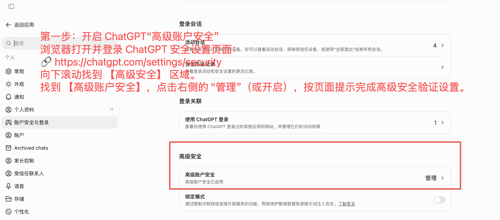
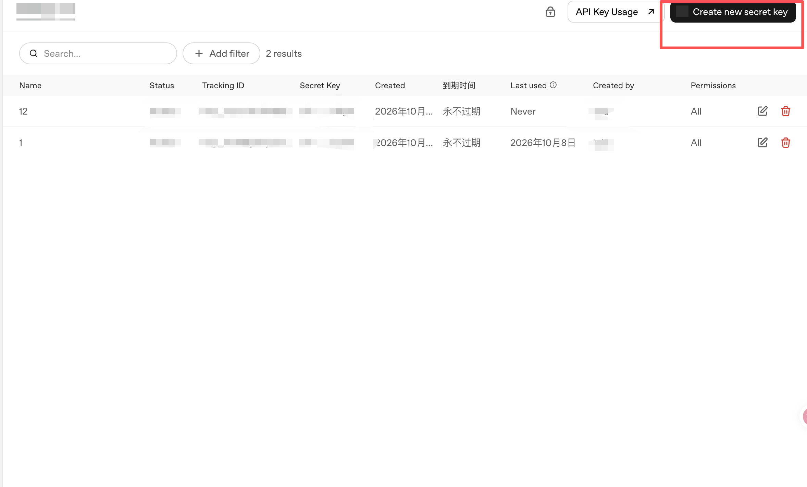
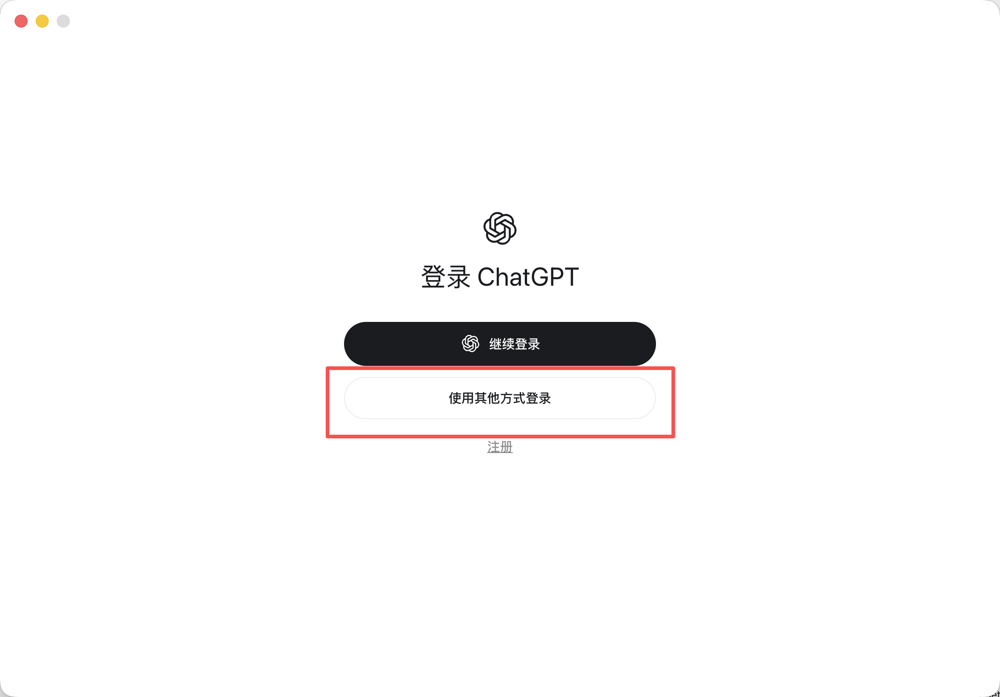
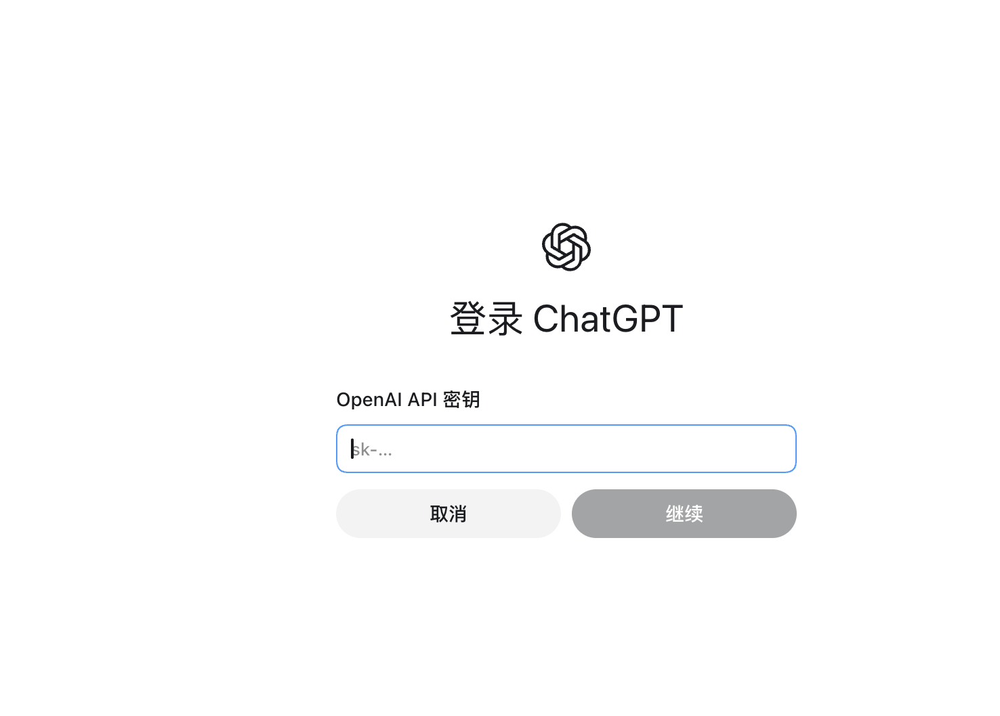
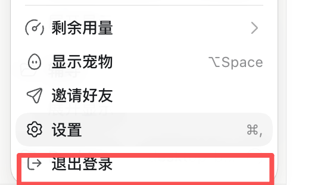
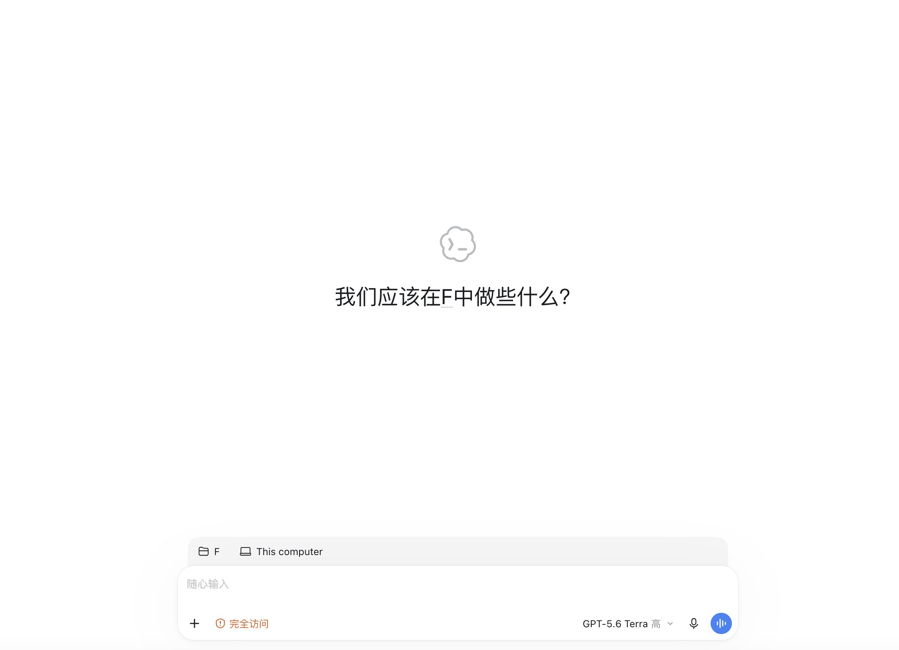

# 绕过 Codex 手机号验证操作教程

> 适用场景：Codex 客户端/插件登录时卡在「添加电话号码（add-phone）」页面，无法完成账号授权。

🌐 **在线版**（单文件，图片内嵌，手机直接打开）：<https://nolaneight.github.io/codex-skip-phone-verification/>

## 核心原理

通过在 ChatGPT 网页端提前开启「**高级账户安全**」，并利用 **OpenAI API Key** 在 Codex 中完成一次底层鉴权，刷新账号在 Codex 客户端的安全标记，从而跳过手机号绑定。

## 第一步：开启 ChatGPT「高级账户安全」

1. 浏览器打开并登录 ChatGPT 安全设置页面：

   🔗 <https://chatgpt.com/settings/security>

2. 向下滚动找到 **【高级安全】** 区域。

3. 找到 **【高级账户安全】**，点击右侧的「**管理**」（或开启），按页面提示完成高级安全验证设置。

图 1｜ChatGPT 安全设置页，红框标出【高级安全 - 高级账户安全】的「管理」入口

## 第二步：获取 OpenAI API Key

> 如果已有 API Key，可跳过此步。

1. 打开 OpenAI API 密钥管理后台：

   🔗 <https://platform.openai.com/api-keys>

2. 点击 **「Create new secret key」**（创建新密钥）。

3. 复制并保存好生成的 `sk-...` 密钥。

图 2｜API 密钥管理后台，红框标出右上角「Create new secret key」按钮

## 第三步：在 Codex 中用 API 方式登录一次

1. 打开你的 Codex 客户端/插件。

2. 登录时**不要直接走网页账号登录**，选择「**使用其他方式登录**」→ 通过 **API Key** 登录（或在配置中填入刚才复制的 API Key）。

图 3｜ChatGPT 登录页，红框标出「使用其他方式登录」按钮

3. 在弹出的输入框中粘贴 API Key，点击「**继续**」。

图 4｜OpenAI API 密钥输入框，填入 sk- 开头的密钥后点击「继续」

4. 确认使用 API Key 登录成功。

## 第四步：登出并切回账号登录

1. 在 Codex 中把刚才通过 API 登录的会话 **登出 / 退出登录**（Log out）。

图 5｜设置菜单，红框标出「退出登录」

2. 重新选择「**通过账号登录**」（Sign in with OpenAI）。

3. 此时网页端授权将正常通过，不再卡在「添加电话号码（add-phone）」页面。

4. 授权通过后，Codex 会直接进入正常使用界面，不会再弹出「添加电话号码」。

图 6｜授权通过，Codex 直接进入可用界面

---

本教程仅供学习交流，请遵守 OpenAI 的服务条款，风险自负。
